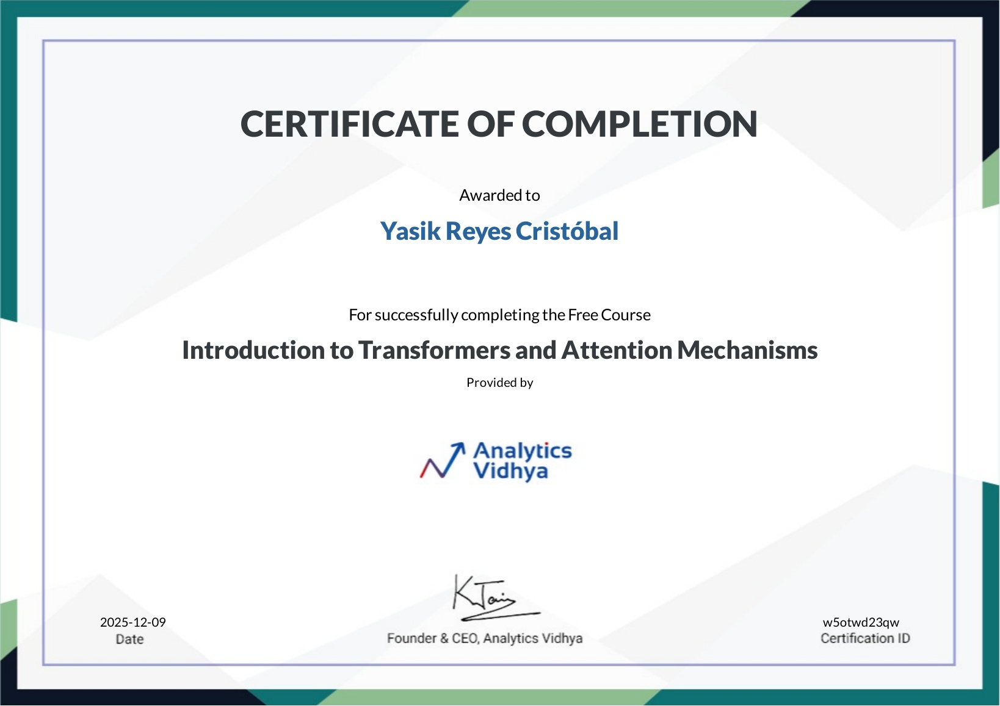

# Introduction to Transformers and Attention Mechanisms

**Institution**: Analytics Vidhya

**Course URL**: <https://www.analyticsvidhya.com/courses/introduction-to-transformers-and-attention-mechanisms/>

## Certificate Details

- **Date**: December 9, 2025  
- **Issued by**: Analytics Vidhya  
- **Level**: Intermediate  

🔗 [Verify certificate](https://courses.analyticsvidhya.com/certificates/w5otwd23qw)

## Description

Comprehensive foundation course exploring the revolutionary Transformer architecture and attention mechanisms that power modern Large Language Models (LLMs). This course covers the theoretical foundations and practical implementations of self-attention, multi-head attention, and the complete Transformer architecture.

## What I Learned

- **Attention Mechanisms Fundamentals**
  - The limitations of traditional RNNs/LSTMs
  - Bahdanau vs Luong attention mechanisms
  - Scaled dot-product attention

- **Transformer Architecture**
  - Encoder-decoder structure
  - Self-attention mechanism
  - Multi-head attention
  - Positional encoding
  - Feed-forward networks
  - Residual connections and layer normalization

- **Practical Applications**
  - Building blocks for BERT, GPT, and other LLMs
  - Text generation and classification
  - Implementation considerations

- **Advanced Concepts**
  - Masked self-attention
  - Cross-attention
  - Computational complexity analysis

## Key Outcomes

Deep understanding of the architectural innovations behind modern NLP models, enabling informed decisions when working with LLMs and transformer-based systems in production environments.

---

[Back to course list](../../../README.md)
