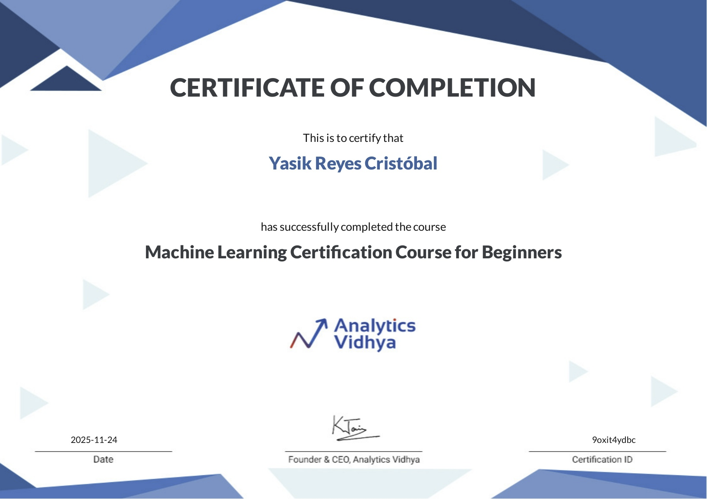

# Machine Learning Certification Course for Beginners – Analytics Vidhya

Free introductory programme that covers the complete machine-learning workflow with Python: from environment set-up and data cleaning to feature engineering, model selection and evaluation.

## 📜 Certificate Details

- **Date**: November 25, 2025  
- **Issued by**: Analytics Vidhya  
- **Level**: Beginner  

🔗 [Verify certificate](https://courses.analyticsvidhya.com/certificates/9oxit4ydbc)

## Syllabus Highlights

- Python crash-course: syntax, data structures, functions, modules  
- Scientific stack: NumPy, Pandas, Matplotlib, Seaborn  
- Data life-cycle: importing, cleaning, aggregating, visualising  
- Exploratory Data Analysis & basic statistics  
- Pre-processing: imputation, scaling, encoding, train/test split  
- Supervised models: k-NN, Linear / Logistic Regression, Decision Trees  
- Model selection: cross-validation, grid-search, hyper-parameter tuning  
- Feature engineering & selection techniques  
- Evaluation metrics: accuracy, precision, recall, RMSE, MAE  

## Tooling

Python 3 | Jupyter Lab | Pandas | NumPy | Scikit-learn | Matplotlib | Seaborn

---

[Back to course list](../../../README.md)
