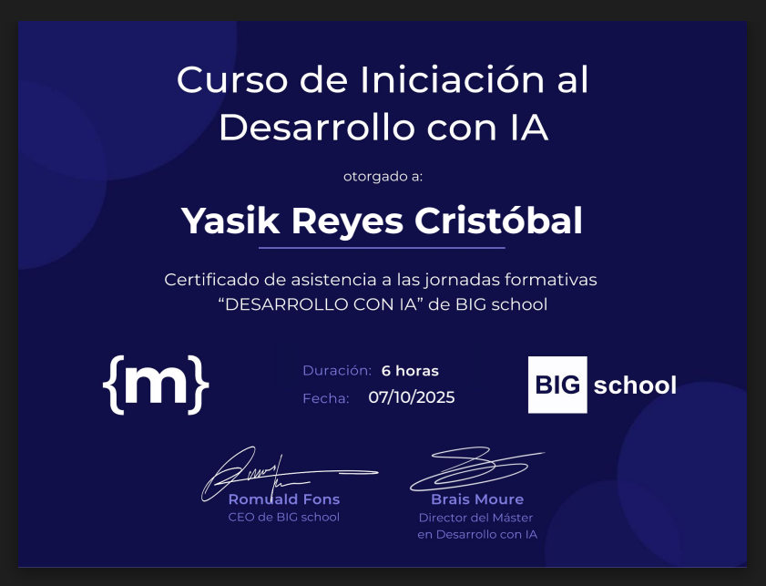

# Introduction to AI Development

## MoureDev + BIG School

Certificate of attendance for the live training series *"Desarrollo con IA"*, covering:

- Professional prompt engineering
- Building and deploying web apps with AI assistance
- Auditing AI-generated code for quality and security
- Boosting productivity in software development using AI tools

## 📜 Certificate Details

- **Duration**: 6 hours
- **Date**: October 7, 2025
- **Issued by**: BIG School & MoureDev
- **Instructors**: Brais Moure, Martí Cristóbal (@bettatech), Carlos Azaustre, Nerea Luis, and others.

🔗 [Course homepage](https://newsletter.moure.dev/p/cursodevia)

## [Back to course list](../../../README.md)
