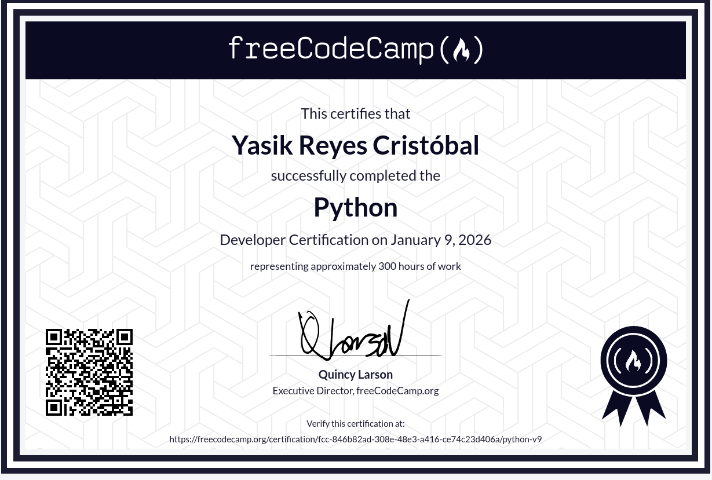

# Python Certification

**Institution:** freeCodeCamp

**Course URL:** <https://www.freecodecamp.org/learn/python-v9/>

## Certificate Details

- **Date Certified:** January 2026
- **Issued by:** freeCodeCamp
- **Level:** Foundational to Intermediate
- **Credential ID:** `fcc-846b82ad-308e-48e3-a416-ce74c23d406a`

🔗 [Verify certificate](https://www.freecodecamp.org/certification/fcc-846b82ad-308e-48e3-a416-ce74c23d406a/python-v9)

## Description
This certification validates the successful completion of freeCodeCamp's extensive Python curriculum, covering fundamental programming concepts, data structures, algorithms, and object-oriented programming. The certification requires building five hands-on projects and passing a comprehensive exam.

## What I Learned
- **Python Fundamentals:** Syntax, data types, functions, and scope.
- **Data Structures & Algorithms:** Lists, tuples, dictionaries, sets, and basic algorithmic thinking.
- **Dynamic Programming:** Understanding and implementing dynamic programming concepts to solve complex problems by breaking them down into overlapping subproblems.
- **Object-Oriented Programming (OOP):** Classes, objects, inheritance, and polymorphism.
- **Program Design:** Debugging, exception handling, and writing clean, maintainable code.
- **Practical Development:** Completing five certification projects that solve defined problems.

## Certification Projects

1. **Build a User Configuration Manager**
2. **Build a Budget App**
3. **Build a Polygon Area Calculator**
4. **Build a Hash Table**

## Key Outcomes
A solid, project-based understanding of core Python programming, enabling the development of efficient scripts, data analysis tools, and foundational back-end applications.

---

[Back to course list](../../../README.md)
