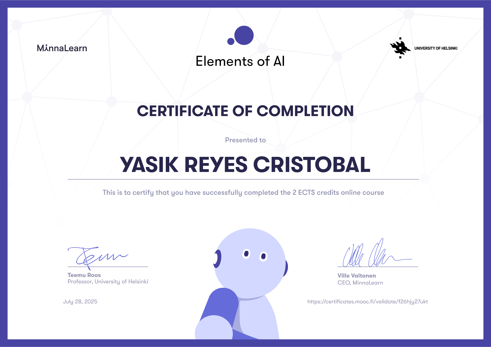

# Element of AI – University of Helsinki

  Official AI program by the University of Helsinki and Reaktor: **Introduction to AI** and **Building AI**.
  Foundational and practical AI knowledge: from ethics and logic to machine learning and neural networks.

  🔗 [Introduction to AI](https://course.elementsofai.com/) | [Building AI](https://buildingai.elementsofai.com/)

## Elements of AI: Introduction to AI

Credits:

- (2 cr, TKT21018)

## Elements of AI: Building AI

Credits:

- (1 cr, TKT210281) Intermediate
- (1 cr, TKT210282) Advanced

## [Back to course list](../../../README.md)
